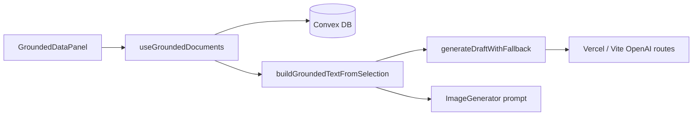

# Grounded Context (Production)

Post Composer **Grounded Context & Files** persists uploads and paste-to-save documents in Convex, scoped by an anonymous browser session id (`localStorage`).

## Architecture



| Layer | Responsibility |
|-------|----------------|
| `GroundedDataPanel` | Upload TXT/CSV/PDF/DOCX/images, select docs, manual editor, delete |
| `useGroundedDocuments` | Session id, Convex queries/mutations, selection state |
| `buildGroundedTextFromSelection` | Merges selected docs + manual paste for prompts |
| `convex/groundedDocuments` | `listBySession`, `createFromText`, `remove` |
| OpenAI routes | Unchanged; receive merged `groundedText` in JSON body |

## Supported files

- **TXT / CSV** — read in the browser (max 512KB).
- **PDF** — text extracted in the browser via pdf.js (max 10MB). Scanned/image-only PDFs fail with a clear error.
- **Word (.docx)** — plain text via mammoth in the browser (max 10MB). Legacy `.doc` is rejected — save as `.docx`.
- **JPEG / PNG** — described via OpenAI Vision (`POST /api/openai/grounded-image`, max 5MB). Requires `OPENAI_API_KEY` on Vercel; **redeploy** after adding the route.

All uploads store `name`, `mimeType`, and extracted `textContent` in Convex `groundedDocuments` (200k chars max per doc, 50 docs per session).

## Security

- No Convex deploy keys or OpenAI keys in the client.
- Documents are isolated by `sessionId` (random UUID in `localStorage`).
- Server validates mime type, size, and max 50 documents per session.

## Local setup

```bash
npm install
npx convex dev          # login, create project, writes .env.local with CONVEX_DEPLOYMENT
```

Add to `.env` (or `.env.local` — Vite loads both patterns; restart dev server after edits):

```bash
VITE_CONVEX_URL=https://<your-dev-deployment>.convex.cloud
```

Run app + Convex:

```bash
npm run convex:dev -- --start 'npm run dev -- --host 127.0.0.1 --port 5173'
# or two terminals: npx convex dev && npm run dev
```

## Production

1. `npx convex deploy` — production Convex deployment.
2. Convex dashboard → **Settings** → copy **Production** deployment URL → Vercel env `VITE_CONVEX_URL`.
3. Vercel: existing `OPENAI_API_KEY` and optional `VITE_*_API_BASE_URL` unchanged.

After schema changes, run `npx convex deploy` before shipping the frontend.
