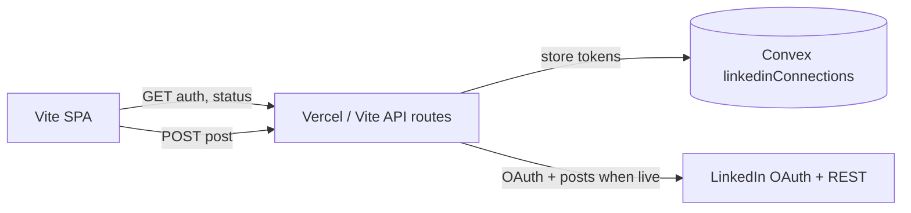

# LinkedIn posting API (seeo Post Application)

This app integrates LinkedIn **OAuth 2.0** and the versioned **Posts API** (`https://api.linkedin.com/rest/posts`). By default **`LINKEDIN_POST_MODE=dry_run`** — no live posts are created until you explicitly set `live`.

## Architecture



| Route | Method | Purpose |
|-------|--------|---------|
| `/api/linkedin/auth` | GET | Start OAuth (`sessionId` query) → redirect to LinkedIn |
| `/api/linkedin/callback` | GET | OAuth callback → store tokens in Convex → redirect to app |
| `/api/linkedin/status` | GET | Connection status + `postMode` |
| `/api/linkedin/post` | POST | Create post (respects `LINKEDIN_POST_MODE`) |
| `/api/linkedin/disconnect` | POST | Remove stored connection for session |

Tokens are stored in Convex table **`linkedinConnections`**, keyed by browser **`sessionId`** (same id as grounded documents — `getGroundedSessionId()` in `localStorage`).

## LinkedIn Developer Portal setup

### 1. Create an app

1. Go to [LinkedIn Developer Portal](https://www.linkedin.com/developers/apps).
2. **Create app** → fill company page association (required for Marketing API products).
3. Note **Client ID** and **Client Secret** (Auth tab).

### 2. Enable products

Under **Products**, request/add:

| Product | Why |
|---------|-----|
| **Sign In with LinkedIn using OpenID Connect** | `openid`, `profile`, `email` — member identity after OAuth |
| **Share on LinkedIn** | `w_member_social` — post as the authenticated member |

For **company page** posting later, add Marketing API access and scopes `w_organization_social` / `r_organization_social` (separate approval; not enabled in this MVP).

### 3. OAuth redirect URLs

Add **exact** redirect URIs (Auth → OAuth 2.0 settings):

| Environment | Redirect URI |
|-------------|----------------|
| Local Vite | `http://localhost:5173/api/linkedin/callback` |
| Vercel preview/production | `https://<your-vercel-host>/api/linkedin/callback` |

Set the same value in **`LINKEDIN_REDIRECT_URI`**.

### 4. Scopes (member posting MVP)

Default authorization request scopes (see `server/linkedinEnv.ts`):

- `openid`, `profile`, `email`
- `w_member_social` — create posts as member

Organization posting would add `w_organization_social` and use `urn:li:organization:{id}` as `author` (not implemented in MVP UI).

### 5. App review

LinkedIn may require **development vs production** tier and partner review for Marketing API. Until approved, only test users added under **App users** can complete OAuth.

## OAuth 2.0 flow

1. User clicks **Connect LinkedIn** → browser navigates to  
   `GET /api/linkedin/auth?sessionId=<uuid>`
2. Server redirects to  
   `https://www.linkedin.com/oauth/v2/authorization` with `state=sessionId`.
3. LinkedIn redirects to  
   `GET /api/linkedin/callback?code=...&state=<sessionId>`
4. Server exchanges code at  
   `POST https://www.linkedin.com/oauth/v2/accessToken`
5. Server loads profile from  
   `GET https://api.linkedin.com/v2/userinfo`
6. Tokens saved to Convex; user redirected to app with `?linkedin=connected`

## Posts API (live mode only)

When `LINKEDIN_POST_MODE=live` and the session has a valid token:

```http
POST https://api.linkedin.com/rest/posts
Authorization: Bearer {access_token}
LinkedIn-Version: 202601
X-Restli-Protocol-Version: 2.0.0
Content-Type: application/json
```

Example body (text-only member post):

```json
{
  "author": "urn:li:person:{memberId}",
  "commentary": "Post text",
  "visibility": "PUBLIC",
  "distribution": {
    "feedDistribution": "MAIN_FEED",
    "targetEntities": [],
    "thirdPartyDistributionChannels": []
  },
  "lifecycleState": "PUBLISHED",
  "isReshareDisabledByAuthor": false
}
```

Response: `201` with `x-restli-id` (post URN). Preview URL pattern:  
`https://www.linkedin.com/feed/update/{encoded-urn}`

Official docs: [Posts API](https://learn.microsoft.com/en-us/linkedin/marketing/community-management/shares/posts-api?view=li-lms-2026-05).

Override API version with **`LINKEDIN_API_VERSION`** (YYYYMM). Default: `202601`.

## Post modes (`LINKEDIN_POST_MODE`)

| Mode | HTTP to LinkedIn | Behavior |
|------|------------------|----------|
| `mock` | None | Success without connection; for unit tests |
| `dry_run` | None | Validates connection (except mock); returns *Would post to LinkedIn (dry run)* + preview-style URL |
| `live` | Yes — `POST /rest/posts` | Creates real post |

**Default:** `dry_run`. Never set `live` in shared staging unless intentional.

## Environment variables

Copy from `.env.example`:

```bash
# LinkedIn OAuth (server-only)
LINKEDIN_CLIENT_ID=
LINKEDIN_CLIENT_SECRET=
LINKEDIN_REDIRECT_URI=http://localhost:5173/api/linkedin/callback

# mock | dry_run | live
LINKEDIN_POST_MODE=dry_run

# Optional: REST API version header (YYYYMM)
# LINKEDIN_API_VERSION=202601

# Where to send the browser after OAuth callback
LINKEDIN_APP_RETURN_URL=http://localhost:5173

# Convex — same deployment as VITE_CONVEX_URL (server routes use CONVEX_URL or VITE_CONVEX_URL)
CONVEX_URL=
VITE_CONVEX_URL=

# Optional production: if API is on another origin
# VITE_LINKEDIN_API_BASE_URL=https://your-app.vercel.app
```

On **Vercel**, add the same variables for Production and Preview. Set `LINKEDIN_REDIRECT_URI` to each deployment host or use a stable production URL.

## Local development

1. `npx convex dev` — deploy schema with `linkedinConnections`.
2. Fill `.env` from `.env.example`.
3. `npm run dev` — LinkedIn routes served by Vite middleware (same paths as Vercel).
4. Connect LinkedIn in Composer → **Post Immediately** calls `POST /api/linkedin/post`.

## Security notes (MVP)

- Tokens are stored in Convex **in application tables** (not encrypted at rest in this MVP). For production, encrypt at rest, rotate refresh tokens, and restrict Convex mutations (e.g. custom auth / internal mutations only callable from server with deploy key).
- `sessionId` is a browser-generated UUID — treat as a weak session secret; do not share links containing it.
- Never expose `LINKEDIN_CLIENT_SECRET` to the client bundle.

## Testing

```bash
npm test -- server/linkedinOAuth.test.ts server/linkedinHandlers.test.ts
```

Tests mock `fetch` for LinkedIn HTTP; no real API calls.

## Related docs

- [LINKEDIN_MONITORING.md](./LINKEDIN_MONITORING.md) — analytics / metrics path when live posting is enabled
