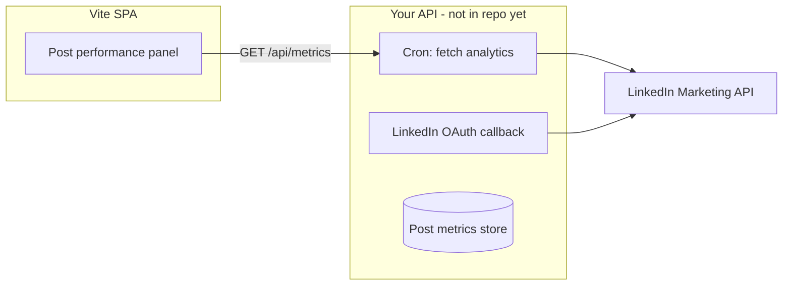

# LinkedIn post performance monitoring

## Audit (current codebase)

**Before this work:** The Dashboard showed aggregate counters (RL index, avg rating, scheduled count, likes+comments from in-app mock posts). There was **no** per-post impressions, engagement rate trends, or LinkedIn API integration.

**Now (MVP):** Dashboard includes a **Post performance** panel (`PostPerformancePanel.tsx`) with per-post mock metrics stored in `localStorage` (`seeo_post_performance_metrics`). Structure is ready for real API fields.

## LinkedIn API reality

| Capability | Typical access | Notes |
|------------|----------------|-------|
| Post as member | OAuth 2.0 (Marketing / Community APIs) | App review, scoped permissions |
| Organic post analytics | LinkedIn Marketing API / partner programs | Often requires company page + approved app |
| Impressions, clicks, engagement | Analytics endpoints on share/ugc posts | Not available from a static SPA without backend token exchange |
| Personal profile analytics | Limited vs Company Page | seeo founders may post as individuals — check latest LinkedIn developer docs |

**Honest limit:** This repo does **not** ship LinkedIn OAuth or a token vault. Production monitoring needs a small backend (store refresh tokens, fetch analytics on a schedule).

## MVP architecture (implemented)

```
Published/scheduled posts (React state)
        ↓
syncMetricsForPosts()  — deterministic mock from post id + status
        ↓
localStorage + Dashboard panel
```

Mock fields align with common analytics shapes:

- `impressions`, `reactions`, `comments`, `shares`, `clicks`, `engagementRate`, `trend`, `source: 'mock'`

## Target architecture (real API)



### Suggested steps

1. Register LinkedIn Developer app; request scopes for posting/analytics as needed.
2. Add server routes: `GET /api/linkedin/auth`, `GET /api/linkedin/callback`, `POST /api/linkedin/sync`.
3. Map API response → `PostPerformanceMetrics` (set `source: 'linkedin'`).
4. Replace `generateMockMetrics` when `source === 'linkedin'` exists for `postId`.
5. Link scheduled posts: match `post.id` to LinkedIn `shareUrn` after publish.

## Mapping autoresearch metrics → post RL

| GPU autoresearch | Post monitoring + RL |
|------------------|----------------------|
| `val_bpb` | `engagementRate` or composite `scoreDraft` |
| keep if improved | Boost STEEP weight / keep draft variant |
| discard | Revert draft; deprioritize hook style |
| `results.tsv` | Experiment log + metrics time series (future) |

Use **live** engagement to nudge weights only after API sync exists; until then, human star ratings in the Composer remain the ground truth.

## Test locally

1. Open Dashboard — confirm **Post performance** lists published/scheduled posts with mock numbers.
2. Publish a new post from Composer — refresh metrics (re-open tab or navigate away/back) to see a new row.
3. Click **Queue** on a scheduled row — navigates to Scheduler tab.
