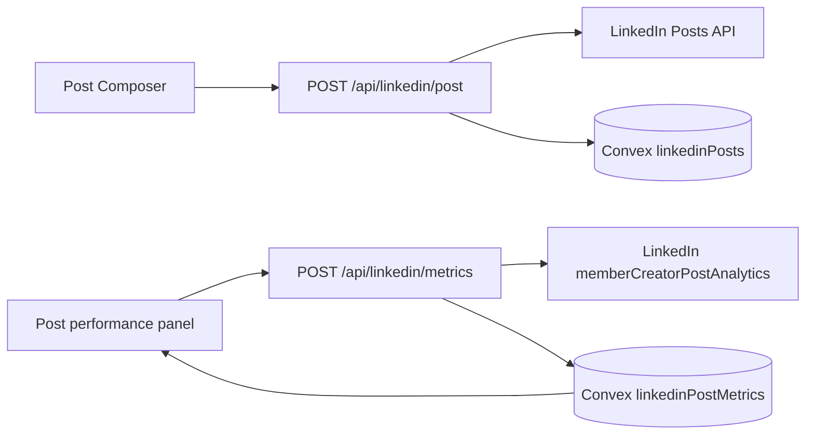

# LinkedIn post performance monitoring

## Current implementation

The Dashboard **Post performance** panel now supports real member-post analytics:

1. Live posts created by `POST /api/linkedin/post` are tracked in Convex table `linkedinPosts` with the returned LinkedIn `postUrn`.
2. `POST /api/linkedin/metrics` calls LinkedIn `memberCreatorPostAnalytics` for each tracked post.
3. Metrics snapshots are stored in Convex table `linkedinPostMetrics`.
4. The Dashboard displays real totals for impressions, reactions, comments, reposts, and engagement rate.

The app intentionally shows `REACTION` rather than “likes only” because LinkedIn member analytics reports total reactions across LinkedIn reaction types.

## LinkedIn API requirements

Member/founder post analytics require OAuth scope:

- `r_member_postAnalytics`

The app requests this by default through `LINKEDIN_ENABLE_MEMBER_ANALYTICS=true`. If LinkedIn has not approved the scope/product yet, OAuth may fail; set `LINKEDIN_ENABLE_MEMBER_ANALYTICS=false` temporarily, then re-enable after approval.

Existing LinkedIn connections must disconnect/reconnect after this scope is enabled so the stored token includes analytics access.

## Metrics fetched

For each tracked `postUrn`, the sync calls `memberCreatorPostAnalytics` with `aggregation=TOTAL` for:

- `IMPRESSION`
- `MEMBERS_REACHED`
- `REACTION`
- `COMMENT`
- `RESHARE`

The app computes:

```text
engagementRate = (REACTION + COMMENT + RESHARE) / IMPRESSION
```

## Architecture



## Auto Researcher integration path

The real metrics are now available in the app as durable Convex data. The next refinement step is to feed high-performing post traits back into the Auto Researcher:

- use engagement rate and impressions as post outcome signals
- compare those outcomes against author, tone, STEEP lenses, and grounded context
- nudge future draft scoring toward patterns that produced real engagement

Human star ratings remain the immediate RL signal; LinkedIn metrics become the delayed real-world signal once enough live posts accumulate.
